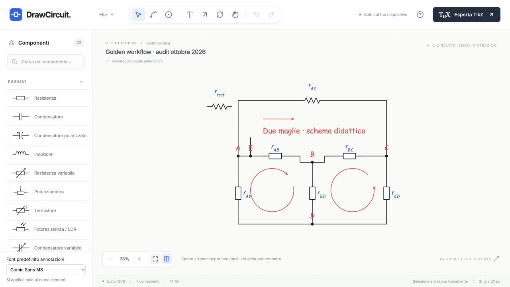

# Audit finale DrawCircuit

Audit del 1–2 ottobre 2026. **Esito: ragionevolmente sì per il disegno didattico**, sulla base del primo uso indipendente, del golden workflow reale, delle regressioni e delle compilazioni. Le limitazioni di verifica sono indicate sotto: non vengono considerate prove riuscite.

## 1–2. Agenti e aree assegnate

Quattro agenti indipendenti, più il coordinatore, hanno coperto i dieci ruoli richiesti. Il limite di concorrenza era quattro processi, quindi il primo uso browser è stato eseguito dopo la prima raccolta.

| Agente                  | Aree                                                                                                  | Evidenza                                                              |
| ----------------------- | ----------------------------------------------------------------------------------------------------- | --------------------------------------------------------------------- |
| `drawing_wires_history` | Workflow A–E, fili, nodi, snapping, waypoint, persistenza e cronologia                                | [Report](drawing-wires-history.md), 16 test UI                        |
| `library_tikz`          | Tutta la libreria, pin, rotazioni, TikZ, fallback e compilazione                                      | [Report](library-tikz.md), matrice UI e misure PGF                    |
| `qa_ux_input`           | Primo uso DOM, UX, tastiera, accessibilità, stress, responsive                                        | [Report](qa-ux-input.md), 14 test e revisione delle immagini          |
| `student_browser`       | Primo uso reale, senza leggere sorgenti, README o Guida                                               | [Report](student-browser.md), batteria/3R/4 nodi/maglia nel browser   |
| Coordinatore            | Qualità del codice, deduplicazione, riproduzione personale, fix, regressioni, golden e stress browser | [Evidenze prima dei fix](master-evidenze.md), screenshot e file reali |

La revisione dell'agente UX si è interrotta per un limite d'uso dell'account; il coordinatore ha completato la rendicontazione. I report già consegnati e le prove eseguite sono conservati.

## 3–8. Problemi trovati e severità

**12 problemi distinti**, dopo deduplicazione. [Elenco con evidenze](problemi-consolidati.md).

| Classificazione    | Totale |
| ------------------ | -----: |
| P0 — blocker       |      0 |
| P1 — major         |      0 |
| P2 — medium        |      9 |
| P3 — minor         |      3 |
| UX high friction   |      0 |
| UX medium friction |      3 |
| UX low friction    |      2 |

I cinque problemi UX U1–U5 sono già inclusi nei dodici, non sono ulteriori bug. Gli altri sette sono difetti tecnici. Le classificazioni derivano dai casi riprodotti, non dal rischio ipotetico.

## 9. Correzioni applicate

| ID  | Priorità | Problema                                                                         | Correzione e verifica                                                                                                                            |
| --- | -------- | -------------------------------------------------------------------------------- | ------------------------------------------------------------------------------------------------------------------------------------------------ |
| M1  | P2       | Import asincroni applicati fuori ordine, o dopo Nuovo                            | Identificatore di richiesta; le letture superate non sostituiscono più il documento. Due regressioni UI riuscite.                                |
| M2  | P2       | Incolla concorrenti generavano label automatiche uguali                          | La duplicazione usa il documento corrente dopo la risposta clipboard. Regressione con due letture concorrenti riuscita.                          |
| M3  | P2       | Ctrl Y durante un drag lasciava il trascinamento attivo                          | Azzeramento del drag, della bozza e dell'overlay prima di Redo. Regressione UI riuscita.                                                         |
| D1  | P2       | Un filo incompleto poteva sospendere indefinitamente l'autosave                  | Si salva il documento confermato durante il gesto; il preview rimane provvisorio. Verificati debounce, cancellazione e ripristino.               |
| D2  | P2       | Nuovo durante Quick Junction registrava la divisione provvisoria in Undo         | Annullamento del gesto prima della sostituzione. La cronologia recupera il documento confermato.                                                 |
| L1  | P2       | Pedici malformati rendevano il `.tex` non compilabile                            | Validazione del subset matematico e testo letterale escaped per input non valido. Cinque file prima falliti ora compilano.                       |
| L2  | P2       | Anchor PNP/PMOS/PJFET orientati al contrario rispetto al canvas                  | Riflessione locale dopo la rotazione. 24 asserzioni numeriche PGF riuscite sui pin reali.                                                        |
| U1  | P2       | Escape ignorato nella conferma Nuovo/Esempio                                     | Chiusura tramite tastiera, verificata in DOM e browser.                                                                                          |
| U2  | P2       | Focus fuori dai dialoghi e nessun contenimento con Tab                           | Focus iniziale, ciclo Tab/Shift Tab, ripristino al trigger. Test UI e controlli della Guida nel browser riusciti.                                |
| U3  | P3       | Escape non chiudeva File; nella prima correzione deselezionava anche il circuito | Il menu consuma Escape prima del canvas. Riprova browser: menu chiuso e selezione conservata.                                                    |
| U4  | P3       | Inserimento ripetuto dei nodi con Shift poco scopribile                          | Hint e Guida spiegano Shift + clic. Comportamento esistente conservato.                                                                          |
| U5  | P3       | Footer export parzialmente tagliato a 1280×720                                   | Altezza della preview adattiva. [Prima](evidence/master-export-before.png) / [dopo](evidence/master-export-after.png); Copy e Download visibili. |

## 10. Miglioramenti UX

Le modifiche riguardano Escape, focus dei dialoghi, scoperta di Shift per i nodi e visibilità delle azioni export. Nessun redesign o nuovo flusso complesso. Nel primo uso reale lo studente ha completato batteria, tre resistenze, quattro nodi e una maglia senza leggere la Guida. La sorpresa principale era la differenza tra inserimento continuo dei componenti e inserimento singolo dei nodi; ora l'hint spiega l'alternativa già disponibile.

La **resistenza statunitense a zig zag** è l'unica aggiunta richiesta successivamente dall'utente: categoria Passivi, alias “zig zag”, stessi pin a/b e prefix R, rotazioni, duplicazione, JSON ed export nativo. La libreria comprende ora **72 simboli**, 63 mapping nativi e 9 fallback. L'export forza `american resistors` sul singolo componente per poter convivere con la resistenza europea. L'opzione è definita nel [sorgente ufficiale CircuitikZ](https://github.com/circuitikz/circuitikz/blob/master/tex/pgfcircbipoles.tex).

## 11. Test automatici aggiunti

La suite è passata da 163 a **281 test**, quindi **118 prove aggiuntive**:

- `audit-master.test.tsx`: 4 regressioni per import concorrenti, paste e Ctrl Y durante drag.
- `audit-drawing.test.tsx`: 16 prove per circuiti A–E, endpoint, snapping, waypoint, atomicità, persistenza, JSON malformati e sequenza lunga Undo/Redo.
- `audit-library-export.test.tsx`: 72 prove UI, una per tipo. Inserimento dalla palette, ogni pin collegato, quattro rotazioni, drag, label/font, duplicazione, cancellazione, Undo/Redo e serializzazione.
- `audit-ux-input.test.tsx`: 14 prove di input, dialoghi, shortcut, primo uso e stress 400 oggetti.
- `exporter.test.ts`: 10 nuove regressioni per formule malformate/valide e orientamento dei tre transistor P.
- `registry.test.tsx`: 2 prove aggiuntive per il tipo US, compresa la distinzione SVG/TikZ fra le due resistenze.

I test di UI montano l'app React e usano controlli e pointer/keyboard events. Non sono dichiarati come 72 prove nel browser reale.

## 12. Segnalazioni non corrette

- `-0` dopo la rotazione: equivalente a `0` nel JSON; nessuna geometria errata dimostrata.
- Waypoint coincidente con un estremo: può conservare la direzione del segmento. Non eliminato quando cambierebbe il percorso.
- Fili dopo eliminazione di componente/nodo: scelta intenzionale; gli estremi diventano punti liberi validi e Undo recupera i riferimenti.
- Selezione azzerata dopo Undo/Redo: comportamento coerente della cronologia, non perdita del documento.
- Proporzioni native CircuitikZ e SVG non perfettamente uguali: limite documentato; orientamento e collegamenti verificati.
- Nessuna micro-ottimizzazione: lo stress non ha dimostrato un difetto prestazionale specifico da correggere.

## 13. Limitazioni rimaste

- **pdfLaTeX non disponibile nel PATH**. Le compilazioni reali usano il compilatore integrato Tectonic/XeTeX. La portabilità pdfLaTeX e la revisione visuale dei PDF non sono certificate da questo audit.
- Font handwritten nell'export richiedono il font installato e XeLaTeX/LuaLaTeX. Il file standard conserva geometria, testo e colori usando i font LaTeX; non incorpora automaticamente Comic Sans/Kalam del canvas.
- Non sono stati misurati FPS, frame drops, heap o input latency del browser. Le metriche del Profiler React/jsdom sono riportate come tali, senza attribuirle al browser.
- L'API di attesa download va in timeout, ma **i file JSON/TEX effettivi sono stati trovati e verificati in Downloads**. Non è un bug del salvataggio dell'app.
- Il percorso keyboard Cmd/Ctrl C/V nel browser controllato non ha prodotto un clone osservabile, anche con una prova in primo piano. Non viene certificato come pass manuale né classificato come difetto dell'app senza distinguere il comportamento del browser ospite. Le prove UI automatiche di copia/incolla e la copia TikZ tramite pulsante passano. Duplicazione e download sono verificati nel browser.
- Il canvas rimane uno strumento desktop per circuiti didattici; non è stato trasformato in un CAD o in un'app mobile.

## 14. Golden workflow reale

**25 passaggi completati nel Browser integrato attraverso il tunnel HTTPS fornito e autorizzato dall'utente.** L'accesso diretto localhost era bloccato; non è stato aggirato. Il circuito è stato costruito con click, trascinamenti e proprietà dell'interfaccia, non importato come scorciatoia al disegno.

| Passaggi | Risultato osservato                                                                                                                                  |
| -------- | ---------------------------------------------------------------------------------------------------------------------------------------------------- |
| 1–3      | Nuovo, sei resistori, tre verticali; uno dei sei è US a zig zag.                                                                                     |
| 4–7      | Dodici fili, nodi A/B/C/D, label r_AB/BC/AC/AD/BD/CD con pedici.                                                                                     |
| 8–11     | Due maglie, inversione di una, testo Comic Sans, label impostata a Kalam; anche freccia normale e label verde.                                       |
| 12–14    | Duplicazione, spostamento del resistore US collegato e del nodo B con tre fili; gli endpoint seguono gli oggetti.                                    |
| 15–17    | Quick Junction: 5 nodi/14 fili; Undo torna a 4/12; Redo torna a 5/14 in una sola azione.                                                             |
| 18–21    | Salva JSON realmente scaricato → Nuovo vuoto → Apri lo stesso file. Tutti i livelli SVG, comprese label, font, colori, fili e frecce, sono identici. |
| 22–23    | Copy TikZ mostra “Copiato”; Download TEX reale è byte per byte uguale al campo standalone; compilazione riuscita.                                    |
| 24–25    | Reload della pagina, ripristino automatico; tutti i livelli SVG risultano nuovamente identici.                                                       |

Documento finale: **30 oggetti**, 7 componenti, 5 nodi, 14 fili, 2 maglie, 1 freccia, 1 testo. Il componente aggiuntivo deriva dalla duplicazione e il quinto nodo dalla Quick Junction.

Prove: [JSON scaricato](evidence/golden-browser.json), [TEX scaricato](evidence/golden-browser.tex), [confronto completo dei livelli](evidence/golden-layer-comparison.json), [reload e console](evidence/golden-reload.json), [atomicità](evidence/golden-quick-junction.json), [download](evidence/golden-downloads.json).

I circuiti B/C/D/E sono stati costruiti attraverso l'interfaccia DOM, serializzati e compilati; le rispettive [fixture](evidence/dom-workflow-b.json) sono conservate con JSON e TEX in `evidence/`. Il primo uso dello studente è un'ulteriore prova browser indipendente.

### Stress e responsive

Importazione UI di **100 componenti + 200 fili + 100 testi** nel browser. Eseguiti pan, zoom verso cursore, selezione, drag, multiselezione, spostamento di gruppo, Undo/Redo e creazione di un filo: totale finale 201 fili. Nessun errore/warning in console nelle letture effettuate. [Screenshot stress](evidence/stress-browser.png). Le prove DOM includono 25 movimenti pan, 20 zoom, 20 drag e 20 cicli Undo/Redo, con metriche separate nel report UX.

Responsive visivo riuscito a **1440×900, 1280×800 e 1024×768**; anche **800×700 dopo Fit** contiene il circuito e mantiene i controlli principali accessibili. [Misure dei controlli](evidence/viewport-layout.json), [finestra stretta con Fit](evidence/viewport-800x700-fit.jpg). Nessun overflow orizzontale sui viewport controllati.

## 15–19. Verifiche finali

| Verifica             | Esito                                                                                                                                                   | Evidenza                                                                         |
| -------------------- | ------------------------------------------------------------------------------------------------------------------------------------------------------- | -------------------------------------------------------------------------------- |
| 15. Build            | PASS, TypeScript e bundle Vite                                                                                                                          | [Log](evidence/final-build.log)                                                  |
| 16. Lint             | PASS                                                                                                                                                    | [Log](evidence/final-lint.log)                                                   |
| 17. Unit/integration | **281/281 PASS, 11 file**                                                                                                                               | [Log](evidence/final-tests.log)                                                  |
| 18. TikZ             | Golden realmente scaricato compilato; matrice 72×4=288 compilata; cinque formule riparate e 24 anchor PGF verificati; fixture A–E e primo uso compilate | [Risultati compilazione](evidence/library-compilation-results.json)              |
| 19. Console          | **0 errori runtime o warning noti nelle letture browser** del golden, stress e primo uso                                                                | [Golden](evidence/golden-reload.json), [studente](evidence/student-console.json) |

**Formattazione: PASS.** Le catture generate e i file scaricati sono esclusi dalla formattazione per conservarli integralmente. [Log](evidence/final-format.log).

## TOP 5 PROBLEMI PIÙ IMPORTANTI TROVATI

| Problema                                             | Causa                                                                     | Correzione applicata                                                   |
| ---------------------------------------------------- | ------------------------------------------------------------------------- | ---------------------------------------------------------------------- |
| Autosave sospeso da un filo incompleto               | Begin/preview cancellavano il timer senza salvare il documento confermato | Salvataggio dello snapshot stabile anche durante il gesto              |
| Import fuori ordine o dopo Nuovo                     | Letture asincrone prive di identificatore di richiesta                    | Applicazione solo dell'ultima richiesta ancora valida                  |
| Quick Junction provvisoria nella cronologia di Nuovo | Replace confermava il preview prima di annullare il gesto                 | Cancellazione della bozza prima della sostituzione                     |
| File TEX non compilabile con label malformata        | Pedici/apici non validati completamente                                   | Scanner del subset matematico e fallback escaped letterale             |
| Fili nativi dei transistor P sul lato opposto        | Orientamento CircuitikZ differente dal renderer SVG                       | Riflessione locale dopo la rotazione, verificata numericamente sui pin |
