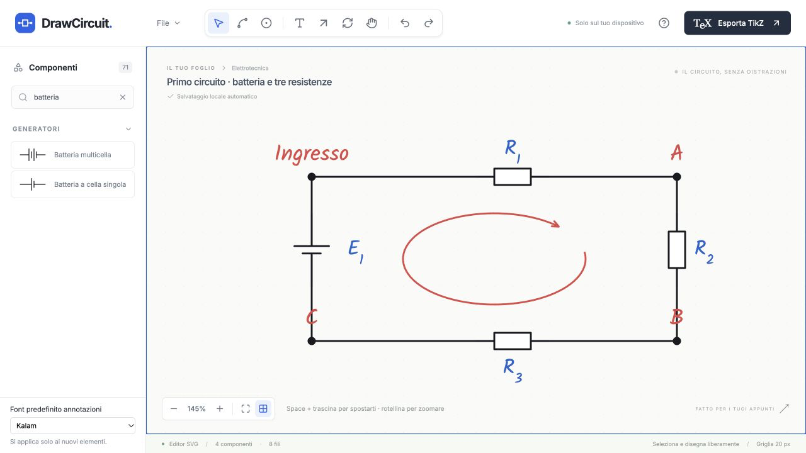

# Audit indipendente: primo uso da studente

Data: 1 ottobre 2026. Prova pre-correzioni, svolta su DrawCircuit nel Browser integrato, URL HTTPS temporaneo autorizzato `https://extract-happens-relationship-authority.trycloudflare.com/`. Viewport osservato: 1280 × 720; zoom del circuito: 145% dopo la creazione del foglio vuoto.

## Metodo e indipendenza

Ho simulato uno studente universitario che deve preparare un circuito per gli appunti. Non ho letto sorgenti, README, report precedenti o manuali dell'app. Ho usato l'interfaccia, gli screenshot reali e il DOM/accessibility tree esposto dal browser. La Guida dell'app non è stata aperta neppure dopo il tentativo iniziale. Ho letto esclusivamente le istruzioni tecniche del Browser, necessarie per operare lo strumento.

Il controllo è stato diretto attraverso l'API documentata del Browser, in un mio tab separato. Non è stata necessaria la modalità operatore/proxy proposta inizialmente dal coordinatore. Nessuna modifica al prodotto e nessun test sul codice. Il tab è stato chiuso dopo la prova per evitare interferenze con la successiva verifica principale. Le schermate sono catture reali: il formato JPEG nativo è conservato e le copie PNG sono conversioni del formato senza alterazione dei contenuti.

## Esito del compito

Completato: una batteria a cella singola, tre resistenze, quattro nodi espliciti, otto fili e una freccia di maglia. Un nodo è stato rinominato da `A` a `Ingresso`; la batteria è stata ruotata dopo l'inserimento e le resistenze durante l'inserimento. La finestra TikZ contava 17 oggetti vettoriali, coerenti con 4 componenti + 4 nodi + 8 fili + 1 maglia.

Il codice TikZ è stato copiato attraverso il pulsante e salvato come prova. Il testo standalone è stato salvato dal campo visibile nella finestra di export. La compilazione LaTeX non è stata eseguita, perché questa prova riguardava soltanto l'esperienza nell'interfaccia.

## Percorso effettivamente eseguito

1. L'apertura mostrava il circuito di esempio esistente. Ho scelto `File` → `Nuovo circuito` → `Crea nuovo`, confermando la sostituzione reversibile descritta dalla finestra.
2. Ho scelto `Resistenza` nella palette e cliccato il foglio a circa `(800,280)`. Il componente R1 è apparso e l'inserimento è rimasto attivo. L'indicazione sul foglio spiegava `R ruota · Esc termina`.
3. Ho premuto R e inserito R2 a circa `(1080,410)`, verticalmente. Ho premuto nuovamente R e inserito R3 a circa `(800,550)`, orizzontalmente con la label sotto. Escape ha concluso l'inserimento.
4. Ho cercato `batteria`, scelto `Batteria a cella singola` e cliccato a circa `(495,410)`. Dopo Escape ho selezionato la batteria e premuto R: è diventata verticale. La barra della selezione mostrava anche `Ruota 90° (R)`.
5. Ho attivato `Nodo (N)` e cliccato l'angolo superiore sinistro. Ho poi cliccato altri tre angoli aspettandomi l'inserimento continuativo osservato per le resistenze: questi clic non hanno creato altri nodi perché lo strumento era già tornato a Selezione. Ho recuperato riattivando Nodo per ogni angolo.
6. Ho fatto doppio clic sul primo nodo: si è aperto il campo `Modifica testo sul foglio`. Ho scritto `Ingresso` e usato `Conferma testo`. Gli altri tre nodi sono risultati A, B e C. Anche il campo `Nome nodo` nella barra della selezione era disponibile.
7. Ho scelto `Filo (W)`. Il messaggio `Clicca un terminale, un nodo o un filo per iniziare` rendeva chiaro il primo passo. I terminali apparivano come cerchi. Ho connesso ogni terminale al nodo adiacente: due clic per filo, otto fili in totale. Il secondo clic su terminale/nodo terminava immediatamente il collegamento e lo strumento Filo rimaneva attivo. Non ho dovuto ripetere o correggere nessuno dei sedici clic di collegamento.
8. Ho scelto `Maglia (L)`. Il messaggio `Trascina un’area per la maglia · handle sulla punta per spostarla` è bastato per disegnare un'ellisse centrale, trascinando da circa `(640,340)` a `(940,475)`. È apparsa una freccia rossa, selezionata con maniglie e comando `Inverti freccia`.
9. Ho modificato il titolo in `Primo circuito · batteria e tre resistenze`, aperto `Esporta TikZ`, usato `Copy TikZ` e poi `File standalone .tex`.
10. Ho premuto `Download .tex` con attesa dell'evento download. L'API del browser è andata in timeout e ha reimpostato automaticamente la propria sessione di controllo. Ho recuperato lo stesso tab, che conservava circuito e finestra export. L'effettivo file scaricato non è verificato: questo è un limite della prova, non una diagnosi di bug del prodotto. Il codice standalone visibile è stato comunque conservato.
11. Dopo aver chiuso l'export, ho controllato la terminazione di un filo libero: nodo C → punto vuoto `(350,600)` lasciava una bozza con istruzione `Enter per terminare`. Enter aumentava i fili da 8 a 9. `Annulla` riportava il totale a 8. Ripetendo la stessa bozza e premendo Escape, la bozza veniva cancellata e tornava Selezione senza aggiungere fili.
12. Ho raccolto la console e lo screenshot finale, poi chiuso il tab.

## Discoverability e attrito osservato

| Area                | Riscontro nel primo utilizzo                                                                                                                                                                                                                                                                       | Valutazione                                                                                   |
| ------------------- | -------------------------------------------------------------------------------------------------------------------------------------------------------------------------------------------------------------------------------------------------------------------------------------------------- | --------------------------------------------------------------------------------------------- |
| Icone della toolbar | La toolbar iniziale è composta da sole icone. I nomi e le scorciatoie erano disponibili nell'albero di accessibilità (`Filo (W)`, `Nodo (N)`, `Maglia (L)`), usato per identificarle. Le label non sono testo visibile permanente. Non ho misurato la comparsa dei tooltip al passaggio del mouse. | Identificabili tramite nomi accessibili; riconoscibilità visiva senza tooltip non verificata. |
| Palette             | Resistenza visibile subito; ricerca `batteria` riduceva i risultati alle due batterie. Hint di inserimento e rotazione immediato.                                                                                                                                                                  | Passaggio riuscito senza Guida.                                                               |
| W e terminazione    | Collegamenti su oggetti completati al secondo clic. Durante una bozza libera l'hint spiega Enter. Escape annulla.                                                                                                                                                                                  | Comportamento verificato; nessun blocco nel circuito richiesto.                               |
| R e nomi            | R è descritto e funziona come rotazione. Il nome del nodo è modificabile con doppio clic e nella barra della selezione.                                                                                                                                                                            | Nessuna confusione tra rotazione e rinomina durante questa prova.                             |
| Maglia / LoopArrow  | L'icona può richiedere il nome accessibile, ma dopo l'attivazione il testo spiega il trascinamento. Una selezione e un trascinamento hanno creato la maglia.                                                                                                                                       | Passaggio riuscito al primo tentativo.                                                        |
| Export              | Pulsante testuale evidente. Tabs codice/standalone e 17 oggetti visibili. Copia riuscita. A 1280 × 720 il margine inferiore della finestra tagliava inizialmente parte dei pulsanti di copia/download.                                                                                             | Frizione di layout minore; download non verificato per timeout dello strumento.               |

## Problemi confermati

| ID         | Priorità / impatto UX | Riproduzione                                                                                                    | Risultato osservato e proposta                                                                                                                                                                                                                                                                                                                                                              |
| ---------- | --------------------- | --------------------------------------------------------------------------------------------------------------- | ------------------------------------------------------------------------------------------------------------------------------------------------------------------------------------------------------------------------------------------------------------------------------------------------------------------------------------------------------------------------------------------- |
| STUDENT-01 | P3 / medium           | Inserire più resistenze senza riattivare la palette; poi attivare Nodo e cliccare quattro punti in successione. | Le resistenze restano in modalità inserimento; Nodo crea soltanto il primo nodo e torna a Selezione. Tre clic iniziali non hanno prodotto i nodi previsti. Per completare ho dovuto riattivare Nodo tre volte. Rendere esplicito nell'hint che l'inserimento è singolo, oppure uniformare il comportamento. Nessuna perdita dati o blocco.                                                  |
| STUDENT-02 | P3 / low              | Aprire Export a 1280 × 720, poi `File standalone .tex`, senza scorrere la finestra.                             | Il bordo inferiore della finestra copre parte di `Copiato` / `Download .tex`; lo screenshot mostra la scrollbar e i pulsanti parziali. Il click via locator può scorrere automaticamente. Valutare footer fisso o altezza della zona codice più contenuta per mantenere interamente visibili le azioni principali. La schermata è evidenza del taglio; misure geometriche DOM non raccolte. |

Nessun problema P0/P1/P2 è stato dimostrato nel percorso richiesto. La prova non pretende di coprire tutti i componenti o tutte le operazioni dell'app.

## Console e limiti

Letture della console tramite `dev.logs({levels:['error','warn'],limit:100})` hanno restituito `[]` dopo il recupero del tab e al termine della prova. Non sono stati catturati errori o avvisi in queste letture. Il timeout dell'attesa download è stato emesso dallo strumento di controllo; non è un errore console dell'app. Non ho esaminato rete, storage, stato interno o sorgenti per colmare il risultato del download.

## Prove salvate

- [Foglio nuovo](evidence/student-01-start.png)
- [Componenti e quattro nodi](evidence/student-02-components-nodes.png)
- [Circuito e maglia appena inserita](evidence/student-03-complete.png)
- [Export e pulsanti parzialmente coperti](evidence/student-04-export.png)
- [Bozza filo e istruzione Enter](evidence/student-05-wire-draft.png)
- [Stato finale](evidence/student-06-final.png)
- [TikZ copiato](evidence/student-export-tikz.txt)
- [Standalone dal campo visibile](evidence/student-export-standalone.tex)
- [Console catturata](evidence/student-console.json)

## Verifica successiva del coordinatore — 2 ottobre

Il file realmente scaricato è stato trovato in `[local-downloads]/Primo-circuito-batteria-e-tre-resistenze.tex` e compilato con successo con il compilatore integrato. Il timeout riguarda l’attesa dell’evento dello strumento; non impediva il download. Questo controllo successivo non cambia ciò che il primo utilizzatore aveva potuto verificare durante la propria prova.
