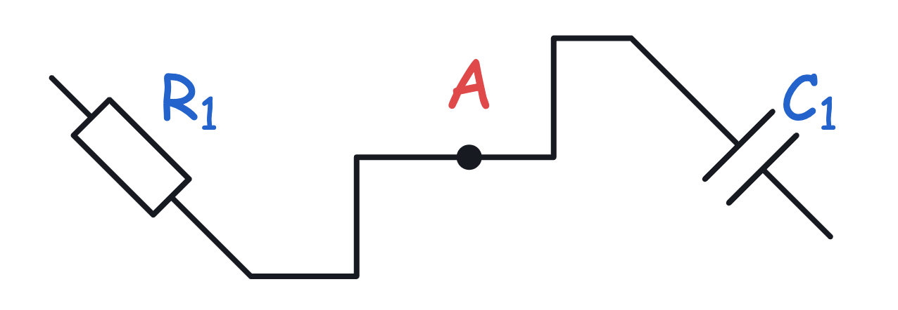
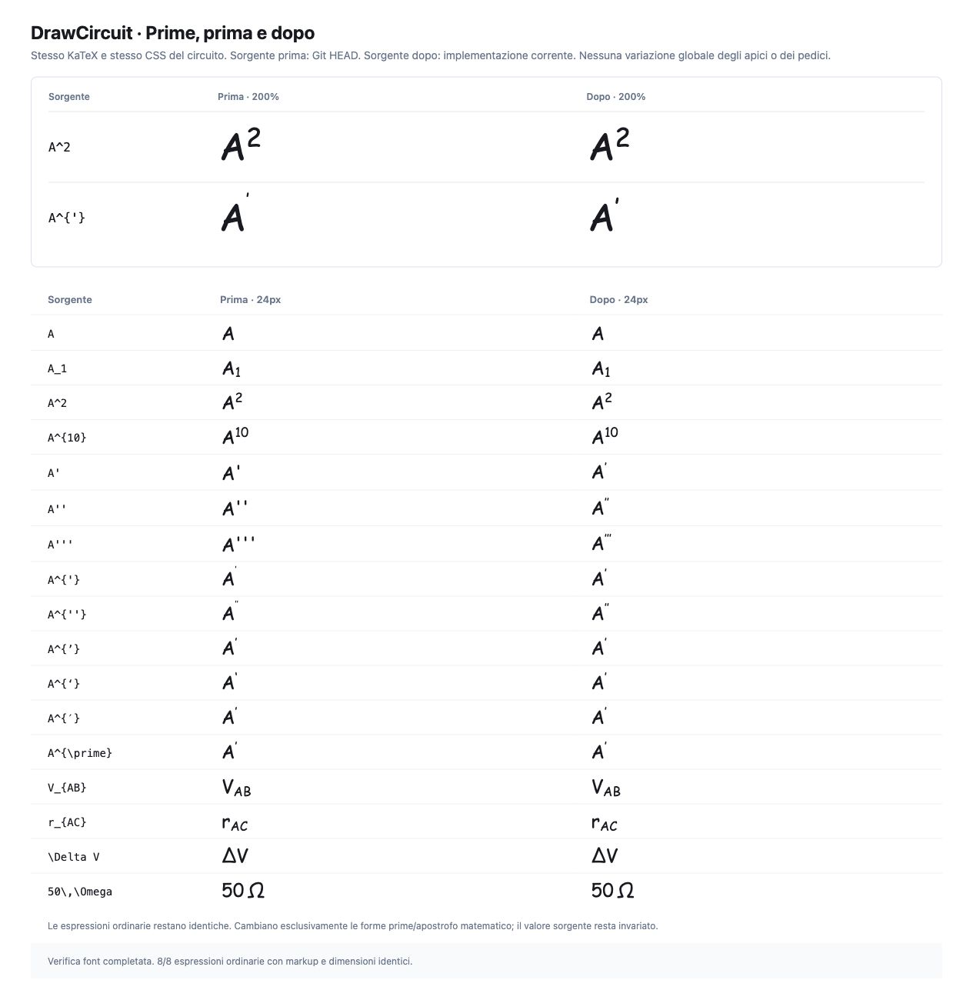
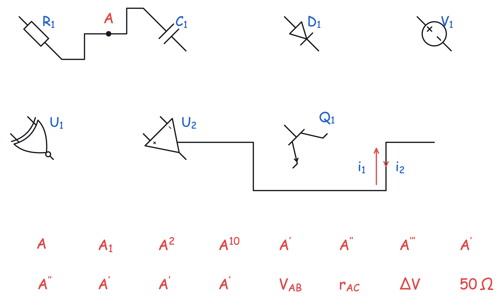

# DrawCircuit — terminali contestuali e affinamento UX

Verifica locale completata il 5 ottobre 2026 con Node 26.5.0. Le sei modifiche riutilizzano selection model, geometria, history ed export esistenti. La pubblicazione e lo smoke test del commit su GitHub Pages sono documentati nel messaggio di consegna.

## Terminali

I terminal handles compaiono quando il componente è selezionato, il puntatore è vicino alla sua hit area oppure è attiva un’azione che richiede terminali: Wire, terminal drag, Junction, tensione e placement dei componenti.

- Ingresso a **24 px** dalla hit area, misurati sullo schermo.
- Uscita oltre **32 px**, con **100 ms** di tolleranza e transizione di opacità di **80 ms**. Il passaggio corpo → terminale non nasconde subito gli handle.
- Prove reali a **50%, 100% e 200%**: la distanza di attivazione resta la stessa in pixel. Verificati resistor, capacitor, source, XNOR, op amp e transistor; incluso anche il diode.
- La ricerca usa i bucket dell’indice spaziale già usato da Smart Placement. L’indice viene riutilizzato per documento; durante pointer move si interrogano i componenti vicini, senza una scansione di tutti gli oggetti. Il controllo finale usa l’inversa della rotazione della hit area.
- Documenti e viewport aggiornati ricalcolano la prossimità anche con puntatore fermo. Durante drag e pan il controllo è sospeso; selection/tool continuano a mostrare gli handle necessari.
- SVG, PNG, TikZ e Obsidian usano la pipeline di export del circuito, che non include questi handle UI.

## Cancellazione

Il modello continua a conservare l’etichetta dentro il suo owner. La selezione distingue il corpo dal subtarget etichetta; non vengono creati nuovi oggetti Text.

| Selezione                                                | Delete / Backspace                                     | Shift + Delete / Backspace                             |
| -------------------------------------------------------- | ------------------------------------------------------ | ------------------------------------------------------ |
| Etichetta componente                                     | Azzera solo il testo; componente e connessioni restano | Elimina componente ed etichetta, con cleanup esistente |
| Corpo componente                                         | Elimina componente ed etichetta associata              | Elimina l’oggetto                                      |
| Etichetta nodo                                           | Azzera solo il testo; nodo e fili restano              | Elimina nodo ed etichetta, con cleanup esistente       |
| Corpo nodo                                               | Elimina nodo ed etichetta, con cleanup esistente       | Elimina l’oggetto                                      |
| Etichetta Current / Voltage / Polarity / graffa / staffa | Azzera solo il testo                                   | Elimina l’annotation owner                             |

Undo/Redo ripristina esattamente documento, testo e connessioni. Le prove automatiche coprono la matrice completa; nel browser sono state ripetute le operazioni su resistor, nodo e tensione. La cancellazione del corpo non converte più la sua etichetta in Text orfano.

Loop Arrow non ha un campo etichetta associato nel modello attuale: un eventuale Text vicino resta un oggetto indipendente e segue la normale cancellazione di Text.

## Rotazione

**R e Ruota avanzano di 45° per i componenti**, inclusa l’anteprima di placement. Sono supportati 0°, 45°, 90°, 135°, 180°, 225°, 270° e 315°.

La trasformazione matematica è condivisa da terminal coordinates, risoluzione degli endpoint, hit area, snapping ed export. Le uscite diagonali dei terminali usano un breve tratto nella direzione del terminale prima di raggiungere il routing ortogonale. I waypoint già disegnati e i rami distanti vengono preservati, mentre si adatta la zona dell’endpoint ruotato. I collegamenti tra pin coincidenti restano invisibili.

Gli offset delle etichette ruotano attorno al componente; il testo resta leggibile con la propria rotazione. Per Smart Measurements si trasformano le forme reali del simbolo e si calcolano gli estremi delle curve nella nuova direzione. I cerchi conservano il raggio, senza ereditare una scatola rettangolare sovradimensionata. I risultati sono memorizzati per tipo e angolo.

Verificati nel browser **sette tipi × otto angoli**, oltre a placement a 45°, terminal drag tra pin diagonali, nudge, sostituzione, Undo/Redo e salvataggio/reinserimento di un blocco personale a 45°. I test automatici controllano tutti i **72 tipi × otto angoli**, connessioni, measurement geometry, serializzazione, blocchi e gli export.

JSON, localStorage, duplicate e copy/paste conservano gli otto angoli. SVG e PNG usano la stessa geometria; TikZ e Obsidian accettano e conservano le rotazioni diagonali.

Il comando sui soli oggetti non componenti conserva lo step precedente di 90°. L’anteprima dei Blocchi Rapidi conserva 90°; i componenti a 45° salvati nei Blocchi Personali conservano invece il loro angolo. Nelle selezioni miste con componenti, graffe/staffe ed ellissi mantengono le orientazioni supportate dal loro modello mentre la posizione segue la rotazione del gruppo.

## Copia PNG

L’azione è nel menu **… / Altre proprietà** della selezione singola e multipla. Richiama direttamente **`copyPNG(getExportSelection(document, selection))`**, come il normale Export → Solo selezione. Durante la copia il controllo viene disabilitato; al completamento compare **PNG copiato**, senza dialog.

La prova reale della clipboard ha prodotto un PNG per la singola resistenza e uno per **resistor + capacitor + wire + Junction**. Il PNG della multiselezione è **identico byte per byte** a quello ottenuto da Export → Solo selezione → Copia PNG, dopo aver atteso il feedback di completamento in entrambe le operazioni.

## Corrente su un filo

Entrambe le modalità usano lo stesso `ElectricalAnnotation`: `currentPlacement` distingue `external` e `inline`; `wireId` e `wireSegment: { index, ratio }` conservano filo e posizione sul segmento scelto. Il campo `ratio` esistente resta disponibile per i documenti precedenti. L’assenza dei nuovi campi mantiene il comportamento esterno dei documenti legacy.

- **Esterna:** mantiene la freccia parallela al ramo e lo spazio per la label.
- **Integrata:** sovrappone la punta al centro scelto sul segmento, mantenendo continua la linea del Wire. Il tratto trasparente resta solo hit area; non viene aggiunto uno stelo visibile parallelo. La label usa l’offset esistente, normalmente sotto il ramo.
- Il piccolo popover **I/V → Corrente su un filo** offre **Esterna / Integrata**; il menu contestuale permette di cambiare **Posizione → Esterna / Sul filo**.
- **Inverti freccia** funziona in entrambe le modalità, senza cambiare topologia.
- Movimento, ridimensionamento e modifica dei waypoint mantengono l’associazione al segmento. Quando cambia il numero dei segmenti, la posizione viene rimappata sul ramo sopravvissuto quando possibile.
- La divisione del filo per Junction, Smart Placement o Inline Insertion usa l’annotation originale per scegliere il frammento corretto. La prova reale ha individuato e corretto un salto di segmento durante la normalizzazione; il caso è ora coperto da due regressioni e ripetuto nella build finale, con Undo/Redo.
- SVG, PNG, TikZ e Obsidian condividono la geometria della punta e omettono lo stelo aggiuntivo nella modalità integrata.

Nel browser verificati inserimento esterno e integrato sullo stesso ramo verticale, inversione di entrambe le frecce, cambio modalità, spostamento del filo, modifica del waypoint associato, modifica di un waypoint precedente, split e inserimento inline su un tratto precedente. Le correnti restano sul ramo verticale anche dopo split, Undo e Redo.

## Prime e apostrofi matematici

In `A^{'}`, KaTeX interpretava l’apostrofo dentro l’apice come ulteriore notazione di apice: il prime finiva in uno stile ancora più piccolo. La correzione normalizza esclusivamente gli argomenti di apice/pedice composti da prime/apostrofi, preferendo `\prime`; tratta anche apostrofi tipografici e Unicode prime in contesto matematico. Le forme native `A'`, `A''` e `A'''` vengono riconosciute come matematica.

La sorgente salvata resta invariata, ad esempio **`A^{'} → render A^{\prime}`**. Non c’è migrazione. Non sono cambiati CSS, scala o font size degli altri apici/pedici. Testo ordinario, argomenti testuali TeX e `\verb` sono protetti dalla normalizzazione.

Il confronto reale nel browser usa il renderer del commit precedente e quello aggiornato con gli stessi font e CSS. Le **otto espressioni senza prime** hanno markup KaTeX e dimensioni identici: `A`, `A_1`, `A^2`, `A^{10}`, `V_{AB}`, `r_{AC}`, `\Delta V` e `50\,\Omega`. Le forme prime risultano leggibili e coerenti. Verificata anche la modifica reale di Text a `A^{'}`, con sorgente conservata e Undo.

## Quality e prove

- `npm ci`: completato con Node 26.5.0, nessuna vulnerabilità segnalata.
- **Lint:** passa.
- **Test:** **51 file, 1.578 test passati**, ultima esecuzione completa dopo la correzione dello split.
- **Build TypeScript + Vite + PWA:** passa; bundle finale `index-Dks3OpF4.js`.
- **Browser su production preview:** interazioni descritte sopra eseguite tramite UI e clipboard reali; console error/warn vuota.
- **PWA / localStorage:** aggiornamento alla build finale tramite Aggiorna conserva i sette componenti a 45°, le due correnti e i blocchi personali.
- **Smoke aggiuntivi nel browser:** placement libero e assistito, Wire, crossing, Junction sul ramo, terminal drag, Text/LaTeX, nudge e drag dei componenti a 45°, Arrow, Loop Arrow, polarità, tensione, graffa, staffa, selezione/multiselezione, pan e zoom. Le modifiche di prova sono state annullate.
- **Regressioni automatiche:** copertura esistente completa per drawing, Smart Placement, Inline Insertion, misure, export, blocchi, replace, storage e PWA; nuove prove mirate per le sei modifiche.
- **Export reali:** SVG, PNG, TikZ e Obsidian generati dalla UI; PNG completo ispezionato visivamente. Le stringhe SVG/TikZ/Obsidian non contengono NaN/Infinity e il simbolo ruota correttamente. Il TikZ generato è verificato dai test di export; in questo pass non è stato compilato con un motore TeX esterno.

Le evidenze includono i log finali, le coordinate dei terminali agli otto angoli, le misure dello zoom, le prove di split/inserimento inline, screenshot, PNG di selezione ed export. La sola avvertenza nell’esecuzione dei test è quella sperimentale di Node su localStorage; non compare nella console browser.

Non restano regressioni note nelle sei modifiche richieste. Le orientazioni preesistenti degli oggetti non componenti e l’assenza di un’etichetta owner per Loop Arrow sono esplicitate sopra.
