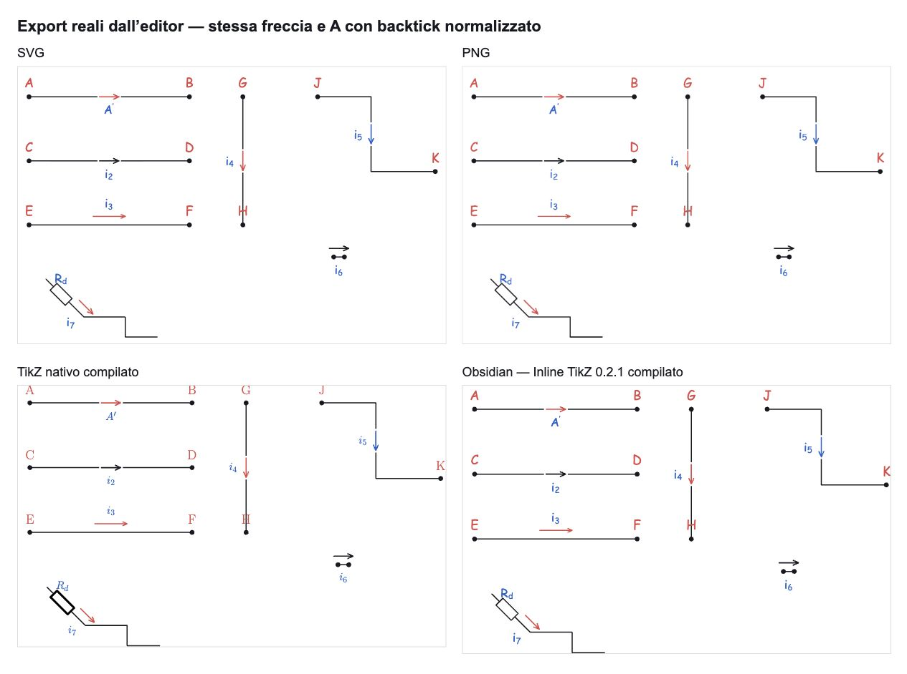

# Corrente integrata leggibile e backtick come prime

5 ottobre 2026. Modifica mirata, senza migrazione del documento e senza nuove dipendenze.

## Corrente integrata

Il renderer precedente disegnava soltanto una piccola punta sopra il filo continuo. Lo shaft coincideva con lo stroke del Wire e una corrente nera sul filo nero risultava difficile da distinguere.

La nuova geometria di disegno, condivisa fra canvas e exporter, sovrappone una **maschera bianca**, uno **shaft visibile** e una **punta aperta**. Il Wire originale rimane un unico oggetto: endpoint, waypoint, Junction, riferimenti e connectivity non cambiano. La geometria logica usata per ancoraggio, history e posizione della label resta separata dalla geometria visiva.

| Misura                                       | Canvas                                          |
| -------------------------------------------- | ----------------------------------------------- |
| Shaft ordinario                              | 36 pixel sullo schermo                          |
| Shaft minimo su un ramo ancora utilizzabile  | 28 pixel                                        |
| Gap nominale prima e dopo la freccia         | 4 pixel per lato                                |
| Punta                                        | 10 pixel di lunghezza, 9 di apertura totale     |
| Stroke                                       | Spessore scelto, con minimo visivo di 2,2 pixel |
| Distanza minima della maschera dagli estremi | 6 pixel per lato                                |

Le misure sono convertite attraverso lo zoom, verificato a **50%, 100% e 200%**. Gli export usano la stessa geometria alla scala documento corrispondente al 100%; l’ingrandimento successivo dell’immagine scala naturalmente anche la freccia.

Sotto **48 pixel di lunghezza disponibile sullo schermo**, un ramo collegato non può contenere shaft minimo, gap e margini: si usa una freccia parallela, lunga 36 pixel e distante 16 pixel dal filo. È un fallback esclusivamente visivo: `currentPlacement` resta `inline`, il riferimento al segmento resta salvato e la resa integrata ritorna quando c’è spazio. La label mantiene il proprio sistema di posizione, colore, font size e offset. Per un’annotazione esportata senza il filo, la soglia è 36 pixel perché non occorre proteggere gli endpoint del ramo.

Orizzontali e verticali usano la tangente del segmento scelto. La diagonale è stata verificata sul collegamento reale del terminale di una resistenza ruotata a 45°: il breve lead usa il fallback a 50–200% e torna integrato a 400%. Reverse cambia la punta e conserva shaft e maschera nella stessa posizione. La selezione evidenzia solo l’annotazione e mantiene il corridoio di hit, senza handle permanenti.

La **Current Arrow esterna** mantiene geometria, dimensioni e stile precedenti. La modifica non cambia gli altri simboli né il loro rendering.

## Backtick e prime

La causa era nella normalizzazione: il backtick non figurava tra i caratteri riconosciuti negli apici composti da prime. ``A^{`}`` arrivava a KaTeX come grave tipografico nel normale stile superscript, anziché come simbolo matematico `\prime`. Non era necessario cambiare la scala degli apici o il CSS.

La normalizzazione condivisa riconosce ora il backtick **solo negli argomenti di superscript composti da prime**, con o senza graffe. Un backtick diventa `\prime`; due o tre diventano due o tre prime. Sono gestite anche combinazioni con apostrofi, apostrofi tipografici, Unicode `′` e `\prime`.

Il valore originale è preservato: nel browser il textbox e `data-source` contengono **A con superscript backtick**, mentre l’annotazione matematica renderizzata e il TikZ contengono `A^{\prime}`. Non si modificano testo normale come `` usa `questo` ``, backtick isolati, argomenti testuali TeX, `\verb`, pedici con backtick o apici misti come ``A^{2`}``.

**A, A₁, A², A¹⁰, Aⁿ, r_AC e V_AB sono invariati.** I test confrontano il markup KaTeX byte per byte; il confronto visivo affiancato usa il renderer del commit precedente. Non sono cambiati baseline, Comic Sans, font size, scala globale di superscript/subscript o CSS. Il canvas, SVG/PNG e TikZ/Obsidian passano dalla stessa normalizzazione.

## Prove effettive

- Browser locale: correnti rosse e nere, stessa tinta del Wire, modalità esterna, Reverse, selezione, zoom 50/100/200, allungamento e accorciamento del ramo, Undo, verticale, waypoint e lead diagonale reale a 45°. L’allungamento ricentra la freccia; l’accorciamento attiva il fallback; Undo ripristina il ramo e la resa integrata. L’editing di un waypoint non fa saltare la corrente su un ramo orizzontale.
- Prime: confronto prima/dopo di **22 sorgenti**; i quattro casi backtick cambiano, gli altri 18 conservano lo stesso markup. ``A^{`}`` è stato inserito anche tramite le proprietà dell’annotazione nell’editor.
- Export reali generati dalla UI: **SVG, PNG, TikZ e Obsidian**. Il PNG è stato letto dagli appunti e ispezionato; l’export della sola annotazione contiene maschera, shaft e punta. L’SVG e il PNG mostrano gli stessi gap e lo stesso prime.
- Il `.tex` aperto nell’editor desktop è stato aggiornato in place con l’export reale e **compilato con successo dal compilatore integrato**, mantenendo aperto lo stesso documento.
- Obsidian e il TikZ nativo, con il normale preambolo `circuitikz`, sono stati compilati con il **bundle effettivamente installato di Inline TikZ 0.2.1**, in un processo isolato. Gli SVG compilati sono stati confrontati nel browser. Il TikZ nativo mantiene i suoi font TeX precedenti; Obsidian mantiene il rendering del canvas. Per osservare correttamente i glifi del SVG nativo, l’anteprima locale usa i font del compilatore installato: nessun font è aggiunto al repository o distribuito dall’app. Non è stata eseguita una prova dentro l’interfaccia della nota Obsidian.
- Console browser locale: **nessun errore né warning**.

## Quality

**22 casi automatici aggiuntivi rispetto al commit precedente**, inclusi geometria in screen space, quattro direzioni, reverse, verifica dei pixel dei gap con freccia nera, diagonale reale, fallback, resize, export completo/di selezione e regressioni dei prime. I test controllano anche che rendering ed export non modifichino la serializzazione del documento.

| Check  | Risultato                       |
| ------ | ------------------------------- |
| Node   | 26.5.0, come `.nvmrc`           |
| Lint   | Passato                         |
| Test   | 52 file, **1.600 test passati** |
| Build  | TypeScript, Vite e PWA passati  |
| Bundle | `index-DJxy7mnK.js`             |

L’unica avvertenza dei test è quella sperimentale di Node su localStorage, già presente nel progetto; non compare nel browser. Nessuna nuova dipendenza, credenziale, build generata o licenza viene pubblicata.

La pubblicazione segue `.github/workflows/deploy-pages.yml`: commit e push a main, attesa del job build e del job Pages, controllo del bundle e prove browser sul sito pubblico per lo stesso commit. Commit, run Actions e risultato finale del controllo pubblico sono riportati nel resoconto della chat.

## Evidenze

- [Confronto prima/dopo: corrente e 22 formule](evidence/prime-comparison.png)
- Canvas a [50%](evidence/canvas-50.png), [100%](evidence/canvas-100.png), [200%](evidence/canvas-200.png); [misure DOM](evidence/browser-zoom.json)
- [Prime inserito nell’editor](evidence/canvas-prime.png), [Reverse e nero sul nero](evidence/selected-reversed-black.png), [ramo accorciato](evidence/shortened-wire.png), [waypoint](evidence/waypoint-resize.png), [diagonale integrata](evidence/diagonal-400.png)
- [Confronto dei quattro export](evidence/export-comparison.png), [SVG](evidence/export.svg), [PNG](evidence/export.png), [TikZ](evidence/export.tikz), [Obsidian](evidence/obsidian.md)
- SVG compilati [Obsidian](evidence/obsidian.svg) e [TikZ nativo](evidence/native-tikz.svg); attestazioni del compilatore [Obsidian](evidence/obsidian-compiler.json) e [TikZ](evidence/tikz-compiler.json)
- Log di [lint](evidence/lint.log), [test](evidence/tests.log) e [build](evidence/build.log)

