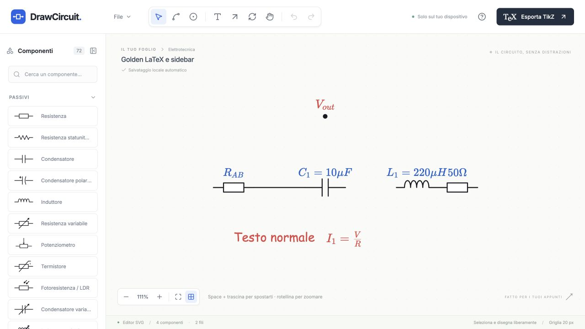

# Label LaTeX, Comic Sans e barra componenti

Verifica del 2 ottobre 2026. Implementazione completata nelle aree richieste; la libreria rimane di 72 componenti. Build e lint passano; **401/401 test** in 15 file passano. Il Golden Workflow è stato eseguito nell’app reale sulla build di produzione. Due documenti `.tex` generati dall’exporter hanno compilato con successo nel compilatore integrato.

1. **Rimozione di value.** Eliminato da `CircuitComponent`, creazione dei componenti, toolbar contestuale, secondo testo SVG ed export TikZ. Rimane un solo source in `label.text`; l’oggetto `label` conserva offset, colore, dimensione e rotazione. Il testo interno dei blocchi mantiene la sua funzione preesistente. File principali: [types.ts](../../src/model/types.ts), [ContextToolbar.tsx](../../src/components/properties/ContextToolbar.tsx), [CircuitLayer.tsx](../../src/components/editor/CircuitLayer.tsx).

2. **Migrazione dei vecchi dati.** Il deserializzatore JSON v1 è usato anche per il documento in localStorage. Una label non vuota prevale; se vuota, composta da spazi o mancante, usa il vecchio valore. Gestisce sia `label.text` sia il vecchio esempio abbreviato con `label` stringa. Rimuove `value` e le scelte font dal modello interno, preservando geometria e riferimenti dei fili. La validazione di terminali, ID, colori, coordinate e tipi rimane attiva. [serialization.ts](../../src/model/serialization.ts).

3. **Rendering LaTeX.** KaTeX 0.19 è il motore condiviso di componenti, junction, annotazioni e preview inline. Le formule usano HTML/MathML dentro un `foreignObject` SVG; la misura del contenuto aggiorna ancoraggio e area di interazione. `React.memo` e una cache limitata a 256 source evitano di ricompilare formule durante pan e zoom. Non c’è un parser TeX manuale. Il modello conserva sempre il source, senza HTML generato. Doppio clic mostra il source; Enter conferma e Esc annulla. Il LaTeX non valido appare letterale e rimane modificabile. [latex.ts](../../src/math/latex.ts), [MathText.tsx](../../src/circuit/annotations/MathText.tsx). L’implementazione usa l’[API ufficiale KaTeX](https://katex.org/docs/api), con [trust disabilitato e limiti di espansione](https://katex.org/docs/options).

4. **Alias aggiunti.** È stato aggiunto soltanto `\ohm`. I normali comandi LaTeX, tra cui `\Omega`, `\mu`, `\alpha`, `\frac` e `\sqrt`, sono gestiti da KaTeX.

5. **Gestione di ohm.** `\ohm` diventa `\Omega` esclusivamente per rendering e TikZ. Il JSON conserva `\ohm`. La normalizzazione riconosce il comando completo e non modifica nomi diversi come `\ohmega`. Verificati `50 \ohm`, `10 k\ohm` e `2.2 M\ohm`.

6. **TikZ delle label.** Il source matematico valido viene racchiuso in `$...$`, preservando comandi e gruppi; si normalizza soltanto l’alias elettrico. Gli input non validi diventano testo letterale protetto per LaTeX. Lo standalone include i pacchetti matematici standard. Con XeLaTeX/LuaLaTeX usa Comic Sans di sistema per il testo normale se presente; con pdfLaTeX, o quando quel font manca, usa il font LaTeX disponibile. Non richiede font proprietari per compilare. La selezione del motore usa [iftex](https://ctan.org/pkg/iftex); i font di sistema sono caricati soltanto nel ramo compatibile con [fontspec](https://ctan.org/pkg/fontspec). [exporter.ts](../../src/tikz/exporter.ts).

7. **Comic Sans nel circuito.** Tutto il testo normale del circuito, incluse label, nodi, annotazioni e testi interni dei simboli, usa `"Comic Sans MS", "Comic Sans", cursive`. La UI mantiene Inter. Dopo il controllo dei font, anche lettere, numeri, Ω e simboli greci delle formule e della preview usano Comic Sans; KaTeX conserva la composizione matematica. Verificati nel browser i font applicati a ogni glifo, l’anteprima durante la modifica, frazioni, radici e sommatorie. Nessun file Comic Sans è stato aggiunto. [styles.css](../../src/styles.css:1500), [fonts.ts](../../src/model/fonts.ts).

8. **Vecchie opzioni font rimosse.** Rimossi font della selezione, preferenza in fondo alla palette, stato/font predefinito nello store, opzione handwritten e dropdown dell’export, dipendenza e CSS di Kalam. Le vecchie preferenze non influiscono sui nuovi elementi; i vecchi JSON con fontFamily continuano a caricarsi e vengono normalizzati.

9. **Show/hide.** Il pulsante in intestazione nasconde completamente la palette. Un piccolo pulsante sul bordo del canvas la riapre. La palette rimane montata, mantenendo ricerca e categorie. Il canvas occupa tutto lo spazio liberato: a 1280 px passa da 1048 a 1280 px quando la sidebar da 232 px viene nascosta.

10. **Resize.** Separatore destro con pointer capture, limiti 200–480 px, supporto frecce/Home/End e doppio clic per ripristinare 232 px. Su viewport più piccole la larghezza effettiva è limitata anche al 45% della finestra, senza cambiare la preferenza salvata. Niente animazioni durante il trascinamento. Il ResizeObserver aggiorna la superficie e conserva zoom e punto del mondo al centro; le coordinate del pointer leggono il bounding rect corrente. [ComponentSidebar.tsx](../../src/components/palette/ComponentSidebar.tsx), [useCanvasInteractions.ts](../../src/components/editor/useCanvasInteractions.ts).

11. **Persistenza.** Visibilità e larghezza sono salvate in `drawcircuit.sidebar.v1`, separatamente dal documento e dalla cronologia undo/redo. Verificati reload con sidebar nascosta e reload dopo resize. Preferenze malformate o storage indisponibile usano default funzionanti. Il JSON realmente scaricato non contiene campi sidebar, value o fontFamily.

12. **Test aggiunti e aggiornati.** [latex.test.tsx](../../tests/latex.test.tsx) verifica tutti gli esempi richiesti, strutture matematiche reali di frazione/radice/pedice, input invalidi, preview, source invariato, migrazione e TikZ. [sidebar.test.tsx](../../tests/sidebar.test.tsx) verifica apertura/chiusura, limiti, reset, reload, storage, camera e placement/snap/fili/pan/zoom dopo resize. I test delle opzioni font sono stati adattati al comportamento unico. Restano attivi i workflow dei 72 simboli, fili, Quick Junction, Smart Placement e inserzione inline, selezione, drag, rotazione, maglie/frecce, storia, clipboard, duplicazione e JSON. Il lungo Golden Workflow DOM ha un timeout locale di 10 secondi per il DOM matematico più ricco. Totale: **401 passati**, rispetto a 334 nella baseline.

13. **Golden Workflow nel browser.** Eseguiti Resistor con `R_1 = 50 \ohm`, poi modifica da source a `R_{AB}`; Capacitor `C_1 = 10 \mu F`; Inductor `L_1 = 220 \mu H`; nodo `V_{out}`; annotazione `I_1 = \frac{V}{R}`; testo normale Comic Sans. Verificati assenza di Valore e font selector, show/hide, minimo/massimo, doppio clic, reload e tre viewport. Dopo resize un resistore è stato inserito con preview **snapped** e riferimento al terminale dell’induttore; è stato disegnato anche un filo manuale. Pan e zoom funzionano, la formula si trascina e una Loop Arrow si crea correttamente. Confermato `R_{` nel canvas, riaperto il source invalido e corretto senza errori. Scaricato e riaperto il JSON, conservando le label; scaricato e compilato il `.tex`. **Console: nessun errore né warning.**

## Evidenze

| Viewport   | Sidebar massima effettiva | Canvas disponibile | Overflow orizzontale |
| ---------- | ------------------------: | -----------------: | -------------------- |
| 1440 × 900 |                    480 px |             960 px | Nessuno              |
| 1280 × 800 |                    480 px |             800 px | Nessuno              |
| 1024 × 768 |                  460,8 px |           563,2 px | Nessuno              |

Zoom e centro del mondo sono rimasti invariati durante queste variazioni della superficie. Il reload ripristina le preferenze della sidebar e mantiene il comportamento preesistente di adattamento iniziale del circuito.

- [Verifica Comic Sans su formule e preview](evidence/comic-font-verification.json), [esempi visivi](evidence/comic-math.jpg), [circuito](evidence/comic-circuit.jpg). Build e lint aggiornati passano; i 401 test passano anche dopo la correzione dei font.
- [JSON scaricato e riaperto](evidence/golden-browser.json).
- [TikZ scaricato e compilato](evidence/golden-browser.tex).
- [Esempi LaTeX compilati](evidence/latex-examples.tex).
- [Misure, source, TikZ e console del browser](evidence/browser-verification.json).
- [Fallback invalido e correzione](evidence/invalid-browser.json).
- [Drag della formula e Loop Arrow](evidence/extra-interactions.json).
- [Build](evidence/build.log), [lint](evidence/lint.log), [test](evidence/tests.log).

La compilazione reale è stata eseguita con il compilatore del desktop; non era disponibile un comando pdfLaTeX nel terminale. Il fallback Comic Sans dipende dai font presenti sul sistema, come richiesto.

