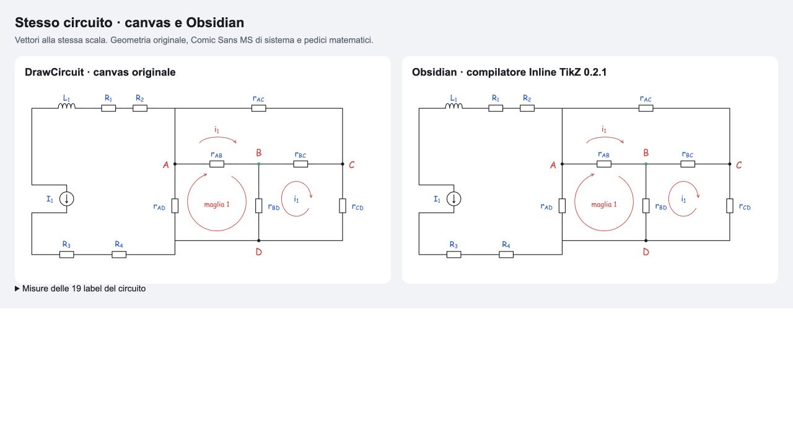
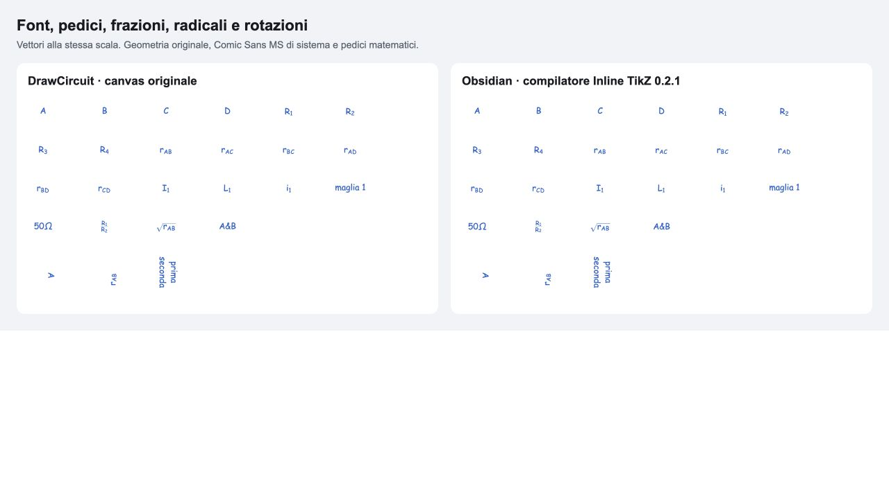

# Export Obsidian WYSIWYG — verifica del 2 ottobre 2026

“Copia per Obsidian” ora riproduce la geometria del canvas e il suo testo vettoriale. Il confronto usa il circuito aperto nel sito, l'output del dialogo reale e il compilatore incluso nel plugin **Inline TikZ 0.2.1** installato sul computer. Non è un mockup del risultato.



Il [JSON del circuito](evidence/golden.json) contiene current source, inductor, quattro resistenze aggiuntive collegate alla rete A/B/C/D con sei resistenze, nodo B verde, label rosse e blu, freccia curva, maglia circolare ed ellittica, `i_1` e `maglia 1`. Il [blocco Markdown](evidence/golden.md) è direttamente incollabile; il [render compilato](evidence/golden.svg) resta vettoriale.

1. **Causa delle differenze dimensionali precedenti.** Il canvas disegna forme SVG con dimensioni precise, mentre l'export standard le sostituiva con simboli CircuitikZ e `bipoles/length=1.4cm`. La lunghezza totale del bipolo non definisce la stessa proporzione del corpo o la stessa distanza dei terminali. Anche i nodi e le punte native aggiungevano geometrie diverse. La conversione precedente di 40 unità/cm dava inoltre circa 0,948 unità CSS per ogni unità canvas nel renderer SVG verificato.

   La fonte visiva rimane `src/model/symbolGeometry.ts`, utilizzata da `Symbol.tsx`, insieme a `MathText.tsx`, `WireView.tsx` e ai renderer delle annotazioni. Nessuno di questi file è stato modificato. Alcune misure effettive, senza stroke:

   | Elemento               | Misura canvas                                | Risultato Obsidian                               |
   | ---------------------- | -------------------------------------------- | ------------------------------------------------ |
   | Resistenza             | corpo 40 × 18; terminali a −40/+40           | stesse forme e coordinate                        |
   | Condensatore           | piastre distanti 12, altezza 34; span 80     | stessa geometria                                 |
   | Induttore              | quattro Bézier, span 80; picco visibile 13,5 | stessi controlli, senza sostituzione del simbolo |
   | Generatori V/I         | cerchio diametro 40, span 80                 | stesso cerchio e segni interni                   |
   | Diodo                  | span 80, corpo alto 28                       | stesso triangolo e catodo                        |
   | Op amp                 | triangolo 48 × 64, span 80                   | stesso triangolo, terminali e testo              |
   | Junction               | raggio 4,5, fill, nessuno stroke             | cerchio pieno di raggio 3,375 pt                 |
   | Freccia di annotazione | punta a chevron 8 × 7                        | stesso chevron, indipendente dallo stroke        |

2. **Causa della differenza di font.** Il sito usa `"Comic Sans MS", "Comic Sans", cursive`, anche nei discendenti KaTeX; le lettere matematiche ordinarie sono diritte. Il renderer TeX precedente usava i suoi font matematici, con metriche e corsivo differenti. Cambiare soltanto `\fontsize` non corregge famiglia, baseline, pedici o spaziatura.

3. **Mapping scelto.** `src/tikz/units.ts` centralizza la conversione: **1 unità canvas = 0,75 pt TeX = 0,026359485 cm**; **37,937007874 unità = 1 cm**. Il renderer installato converte il proprio viewBox in punti a 4/3 CSS px per punto, quindi l'SVG ha un pixel CSS intrinseco per unità canvas. L'asse Y viene invertito nelle coordinate TikZ. Il mapping è costante per 1, 5 o 200 resistenze; non usa `resizebox` o una scala calcolata dal contenuto. La conversione inversa nelle pagine di confronto serve a riportare i punti SVG nelle coordinate del canvas, senza correggere l'export a posteriori.

4. **Stroke width.** La stessa conversione dà **2 unità → 1,5 pt** per componenti e fili e **1,8 → 1,35 pt** nelle frecce del golden. Cap e join sono `round`; i tratti 4/4 del renderer diventano 3/3 pt. Le punte delle annotazioni usano la tangente effettiva di retta, Bézier o ellisse, incluso il verso inverso. Le maglie riutilizzano `loopGeometry`, con larghezza, altezza, apertura, posizione della punta e direzione originali. I colori provengono dal modello: `171A20`, `2463CB`, `DF4949`, `269978`, oltre agli HEX personalizzati.

5. **Font size, offset e bounding box.** `editorFontSizeToTikz` usa lo stesso mapping: **22 → 16,5 pt**, **23 → 17,25 pt**, **27 → 20,25 pt**. Il testo SVG conserva inoltre le dimensioni dei singoli run KaTeX: per un font principale di 22 unità, il pedice normale è di 15,4 unità. L'export misura una copia isolata con il CSS originale, usando gli stessi `offsetWidth/offsetHeight` interi di `MathText`. Non applica padding `above/below` o rotazione automatica con il componente. Allineamento, rotazione esplicita e interlinea del testo vengono mantenuti.

   I quattro angoli delle label misurate entrano nel bounding box PGF, con rotazione e allineamento; forme, stroke e punte contribuiscono con le proprie coordinate. `inner sep`, `outer sep` e `minimum size` sono zero, eliminando anche il precedente offset di mezzo punto sui nodi SVG. Il golden compilato misura circa **972,4 × 477 CSS px** intrinseci e include tutte le label. Una nota Obsidian può comunque adattare l'immagine alla larghezza disponibile tramite il proprio CSS: la scala intrinseca esportata rimane costante.

6. **Componenti che continuano a usare CircuitikZ.** Nella modalità standard **Copy TikZ**, restano i **63 mapping nativi** precedenti e i nove fallback geometrici. L'output standard è stato confrontato byte per byte con il generatore precedente, per tutti i 72 simboli nelle quattro rotazioni e per il golden completo, inclusi fili, nodi, testo, frecce e maglie. `Download .tex` continua a usare questo export standard.

7. **Componenti disegnati con TikZ puro.** In modalità Obsidian sono **tutti i 72**, comprese resistenze e varianti, condensatori, induttori, generatori indipendenti e dipendenti, batterie, diodi, LED, Zener, BJT/FET/MOSFET, interruttori, trasformatori, op amp, porte logiche, strumenti, ground, connettori e blocchi. La geometria proviene dal catalogo SVG condiviso. Il package e l'ambiente `circuitikz` restano disponibili nel wrapper, ma questa modalità non emette `to[R/C/L]` o `bipoles/length`. Non esiste un traversal separato: `generateTikz` condivide validazione, colori, ordine, risoluzione dei fili, normalizzazione delle label e helper; seleziona il modo geometrico e le unità.

8. **Strategia Comic Sans verificata.** Nel setup installato il percorso è **TeX WebAssembly → DVI → SVG**, tramite il compilatore `node-tikzjax/dvi2html` incluso in Inline TikZ, con driver **`pgfsys-ximera.def`**. Il bundle non contiene `fontspec.sty`; una compilazione reale con `fontspec` è fallita. Non offre un selettore XeLaTeX/LuaLaTeX. Offre invece le special SVG `dvisvgm:raw`: una prova reale ha confermato che possono produrre `<text>` che usa i font di sistema.

   L'export usa quel percorso per il testo normale e per i run misurati del layout KaTeX, conservando pedici, frazioni, radicali e il source LaTeX nel codice. `50 \ohm` viene normalizzato in `50 \Omega`. Sul computer sono presenti i font Comic Sans MS regolare e bold in `/System/Library/Fonts/Supplemental/`; non vengono letti o copiati nell'export. Testo e attributi sono serializzati con escaping XML/TeX. L'output non contiene immagini raster.

9. **Limiti e fallback.** Se il dispositivo che apre l'SVG non possiede Comic Sans, il browser sceglie `Comic Sans` o il proprio `cursive`: non si può garantire lo stesso font su quel dispositivo senza distribuirlo. Per driver TeX diversi da quelli SVG supportati, oppure export senza DOM, il fallback usa **sans serif diritto**, disponibile nel bundle come `cmss`, mantenendo lettere e pedici ordinari fuori dal corsivo matematico. La prova `sans.svg` conferma i font disponibili; il [documento fallback](evidence/obsidian-fallback.tex) compila con il compilatore desktop. Anchor e conversione delle dimensioni sono conservati, ma le metriche del fallback differiscono da Comic Sans. Nessun file TTF/OTF è stato aggiunto al progetto.

   Il testo SVG è precalcolato: per cambiare una formula nel codice generato occorre aggiornare anche i suoi run SVG oppure riesportare da DrawCircuit; cambiare soltanto il source del fallback non ridisegna il ramo SVG. La geometria resta modificabile con comandi TikZ e coordinate esplicite.

10. **Test visivi aggiunti.** La pagina separata [visual-fixtures.html](visual-fixtures.html) usa i renderer originali `Symbol` e `MathText` e genera fixture dall'export corrente. Sono state compilate **13 fixture**: dieci tipi principali in quattro orientamenti, font, golden e catalogo completo **72 × 4**. I dieci confronti `getBBox` dell'SVG compilato contro il renderer originale hanno uno scarto massimo di **0,002686 unità**. Le 19 label del golden hanno scarto massimo di **0,003786 unità**, font Comic Sans, weight 400 e style normal. Sono verificati anche testo 90°/270°, start/end, multilinea, `r_{AB/AC/BC/AD/BD/CD}`, `R_1…R_4`, `I_1`, `L_1`, `i_1`, A/B/C/D, frazioni, radici e ohm. I 23 preset passano nello stesso exporter; i test di scala usano 1/5/200 resistenze.

Vitest confronta la geometria corrente con le baseline e controlla SVG compilati e misure salvate; non avvia Obsidian ad ogni test. La rigenerazione delle misure richiede il browser e il bundle del plugin. Non viene usato un confronto pixel-perfect dell'antialiasing. I log delle compilazioni iniziali nel plugin attivo sono in `evidence/compilation.log`; dopo due timeout della coda del plugin, le prove finali sono state ripetute con **lo stesso bundle installato in un processo isolato**, tramite `scripts/verify-obsidian-bundle.mjs`. Nessun motore o plugin è stato installato. La coda del plugin è stata ripristinata riattivando il plugin; le impostazioni e i suoi file non sono stati modificati.

11. **Confronto disponibile.** [Canvas/render affiancati](comparison.html), [font affiancati](font-comparison.html), [screenshot del sito](evidence/canvas.jpg), [SVG compilato](evidence/golden.svg), [misure geometriche](evidence/visual-metrics.json) e [misure delle label](evidence/label-metrics.json). I due pannelli usano coordinate e viewport comuni, con tutte le label incluse. La verifica visiva mostra lo stesso disegno; restano piccole differenze di antialiasing. Il pulsante ha mostrato “Copiato per Obsidian” e il testo dell'anteprima è stato compilato. La lettura degli appunti del browser di prova non ha restituito il contenuto; il test DOM del dialogo verifica il payload completo passato alla Clipboard API.

12. **Build.** `npm run build`: **passata**, TypeScript e bundle Vite. [Log](evidence/build.log).

13. **Lint.** `npm run lint`: **passato, nessun errore o warning**. I file modificati superano il controllo Prettier. [Log](evidence/lint.log).

14. **Test e regressioni.** `npm test -- --maxWorkers=2`: **740 test passati in 20 file**. [Log](evidence/test.log). Il [controllo dei sorgenti](evidence/source-audit.json) conferma 49 file esistenti invariati; cambiano soltanto i due moduli di export e la descrizione nel dialogo di export, con tre nuovi helper in `src/tikz`. Canvas, renderer, modello, JSON, store/localStorage, undo/redo, snapping e Smart Placement non sono stati modificati. L'SVG del canvas prima/dopo l'export è identico. Il documento standalone di verifica del fallback compila con successo.



Per ripetere la compilazione, con il plugin già installato:

```sh
node scripts/verify-obsidian-bundle.mjs "/percorso/vault/.obsidian/plugins/inline-tikz/main.js" docs/obsidian-wysiwyg/evidence/golden.md
node scripts/create-obsidian-comparison.mjs
```

Il primo comando usa il bundle locale senza copiarne asset nel repository; salva SVG, hash del source e hash del compilatore. I riferimenti tecnici sono i progetti ufficiali [Inline TikZ](https://github.com/lachlanharrisdev/obsidian-inline-tikz) e [node-tikzjax](https://github.com/prinsss/node-tikzjax); l'engine e i package descritti sopra sono stati verificati nel bundle effettivamente installato, non dedotti dalle sole documentazioni.
