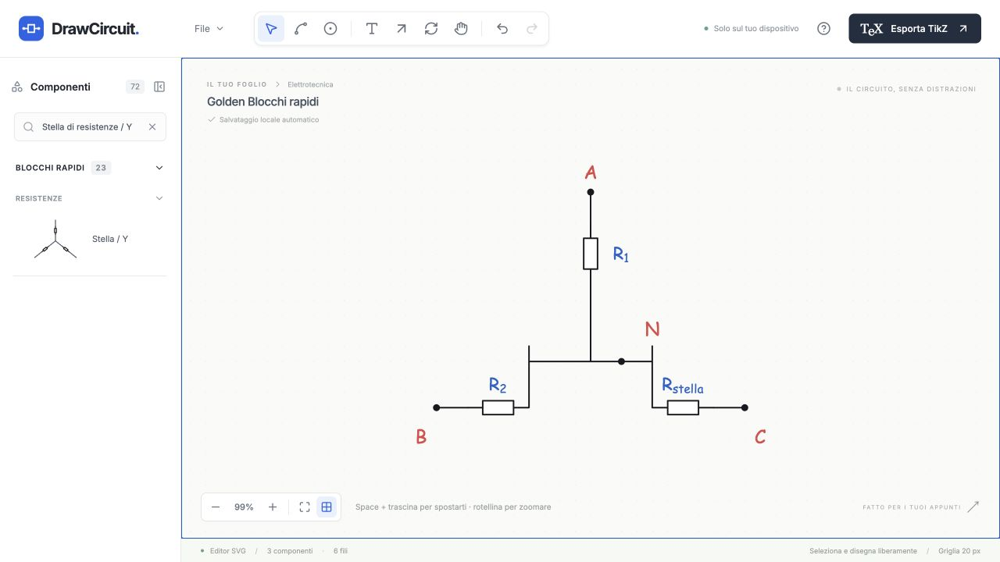
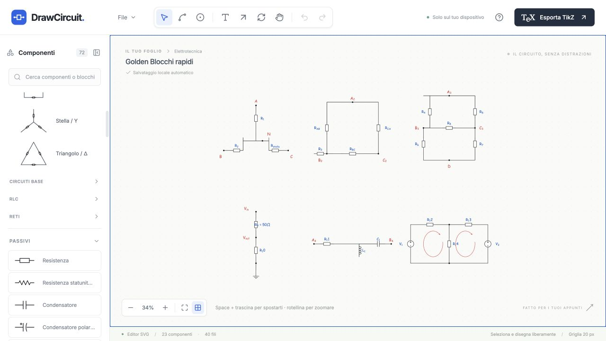

# Blocchi rapidi

Implementazione e verifica del 2 ottobre 2026. Sono disponibili **23 preset**, con componenti, fili e junction ordinari e separatamente modificabili. **Build e lint passano; 478/478 test passano in 17 file.** I due export `.tex` di verifica hanno compilato con successo nel compilatore del desktop.

1. **Preset implementati.** La libreria di componenti rimane di 72 simboli. I blocchi rapidi sono in una sezione separata, inizialmente chiusa, con quattro categorie collassabili, miniature schematiche, nomi brevi e tooltip con il nome completo. La ricerca esistente trova anche gli alias italiani e inglesi e apre i risultati anche quando la sezione è chiusa.

   | Categoria         | Preset                                                                                                                                                                        |
   | ----------------- | ----------------------------------------------------------------------------------------------------------------------------------------------------------------------------- |
   | Resistenze · 6    | Serie ×2; serie ×3; parallelo ×2; parallelo ×3; stella / Y; triangolo / delta                                                                                                 |
   | Circuiti base · 7 | Partitore di tensione; partitore di corrente; ponte di Wheatstone; generatore reale di tensione; generatore reale di corrente; equivalente di Thévenin; equivalente di Norton |
   | RLC · 6           | RC serie; RL serie; RLC serie; RC parallelo; RL parallelo; RLC parallelo                                                                                                      |
   | Reti · 4          | Generatore + resistenza; rete a due maglie; rete a tre rami; generatore + resistenza serie + carico                                                                           |

2. **Registro dichiarativo.** [types.ts](../../src/presets/types.ts) definisce `CircuitPreset`, componenti, junction, endpoint, fili e annotazioni opzionali. [registry.ts](../../src/presets/registry.ts) raccoglie ID stabili, nomi, categorie, alias e geometrie. Serie, paralleli e generatori equivalenti condividono costruttori di dati; l’editor non contiene casi specifici per ciascun circuito. Le posizioni geometriche e i vertici dei fili sono espressi in multipli di `GRID = 20`. La griglia viene rispettata anche quando la sua visualizzazione è disattivata.

   Le geometrie inserite usano i simboli nativi e le rotazioni 0/90/180/270 già supportate dall’editor. Stella, delta e ponte hanno una rappresentazione ortogonale; le miniature semplificate mostrano anche la forma convenzionale a Y, triangolo e diamante. I dati delle miniature appartengono alla palette. Il documento contiene la geometria nativa modificabile.

3. **Generazione degli elementi.** [instantiate.ts](../../src/presets/instantiate.ts) applica offset e rotazione e crea i componenti tramite `createComponent`. I nuovi helper condivisi in [factories.ts](../../src/model/factories.ts) creano junction, fili e annotazioni; sono usati anche dai normali percorsi di creazione, senza cambiare le loro proprietà. Ogni riferimento locale del preset viene risolto in un vero endpoint `terminal` o `junction`. Il rendering e la ghost preview riusano `CircuitLayer`, `Symbol` e `MathText`.

   Le topologie sono verificate attraverso le connessioni: nella stella R1/R2/R3 condividono N e raggiungono A/B/C distinti; il delta collega AB, BC e CA ai rispettivi nodi; Wheatstone ha i quattro bracci AB/AC/BD/CD e il ponte BC. Tutti i terminali dei componenti iniziali sono collegati. Il carico è il normale `blackBox`, con label `LOAD`.

4. **ID.** Ogni istanza genera UUID nuovi con `makeId`; una mappa locale collega le chiavi dichiarative ai nuovi ID. Nessun ID del registro viene riutilizzato come ID del documento. Due inserimenti dello stesso blocco producono insiemi di ID distinti e collegamenti validi. Le preview non entrano nel documento o nella cronologia.

5. **Naming automatico.** L’allocatore riserva le label già presenti e quelle create nello stesso inserimento. Gestisce R/C/L/V/I e normalizza le varianti `R1`, `R_1` e `R_{1}`. Una label come `R_9 = 50 \ohm` riserva anche il nome R9: il preset successivo prosegue senza riutilizzarlo. I nomi semantici rimangono riconoscibili: un secondo delta usa, per esempio, `R_{AB}^{(2)}`; un secondo nodo A usa `A_2`. Le label restano immediatamente modificabili. Il sistema usa solamente `label.text` e non crea `value` o preferenze font.

6. **Undo/Redo e selezione.** [editorStore.ts](../../src/store/editorStore.ts) inserisce tutti gli oggetti con un’unica chiamata al normale `add`, quindi un solo commit. Tutti i nuovi ID sono selezionati. Dopo la deselezione rimangono elementi indipendenti; drag, rotazione, eliminazione e duplicazione usano le operazioni esistenti. La modalità di inserimento è temporanea: scegli un blocco, sposta la ghost, usa **R** per ruotarla, clicca per inserire; **Esc** annulla. Non esiste un gruppo permanente o un nuovo tipo di oggetto circuitale.

7. **Smart Placement e workflow esistenti.** Terminali e junction dei blocchi sono quelli del modello normale, quindi partecipano alla ricerca dei target e al disegno dei fili. Nel browser sono passati Smart Placement sul delta, Wire, Quick Junction, inserimento inline e duplicazione standard. I test preesistenti continuano a coprire anche magnetic snap, click-to-anchor, terminali multipli, selection, pan, zoom, copy/paste, rotazione e clipboard. Hide/show e resize della sidebar conservano zoom e centro del mondo dopo l’aggiornamento del ResizeObserver.

8. **LaTeX e Comic Sans.** Tutte le label usano il source e il renderer esistenti, incluse `R_{AB}`, `V_{out}`, `R_{th}` e i nomi con suffisso. La preview durante la modifica di `R_9 = 50 \ohm` mostra Ω; i glifi del canvas e dell’anteprima usano Comic Sans. La UI mantiene Inter. Il registro non contiene valori numerici, font personalizzati o Loop Arrow automatiche.

9. **JSON e localStorage.** Il documento rimane JSON v1 e contiene soltanto i normali oggetti. L’ID del preset e la modalità di placement sono stato UI temporaneo. Il JSON realmente scaricato dal Golden Test contiene 83 oggetti: 23 componenti, 18 junction, 40 fili e 2 Loop Arrow aggiunte manualmente. Si riapre attraverso `Apri JSON` e il reload conserva gli elementi. La compatibilità legacy rimane coperta dai test esistenti. Il circuito precedente al test è stato salvato e ripristinato.

10. **TikZ.** Viene usato esclusivamente l’exporter esistente. Il `.tex` mostrato ed effettivamente scaricato dal browser coincide con `exportStandalone` del JSON riaperto. Hanno compilato con successo sia il Golden Test sia un documento di verifica contenente tutti i 23 blocchi. Non ci sono exporter specifici per preset.

11. **Test aggiunti.** [presets.test.ts](../../tests/presets.test.ts) verifica registro e alias, factory native, ID nuovi, riferimenti, terminali collegati, coordinate sulla griglia, quattro rotazioni, offset, naming numerico e semantico, annotazioni, Undo/Redo, inserimenti ripetuti, clone, serializzazione, TikZ e topologie stella/delta/Wheatstone. [preset-interactions.test.tsx](../../tests/preset-interactions.test.tsx) verifica palette compatta, miniature, ricerca, ghost, R/Esc, inserimento di tutti i preset, selezione multipla, editing LaTeX, drag, cancellazione e continuazione dei workflow. Aggiunti **77 test**; i precedenti 401 passano ancora. Totale: **478/478**, 17 file.

12. **Golden Test nel browser.** Tutti gli otto passaggi richiesti sono stati completati sulla build di produzione:

| Passaggio  | Risultato                                                                                                                                                 |
| ---------- | --------------------------------------------------------------------------------------------------------------------------------------------------------- |
| Stella     | 3 resistenze, A/B/C/N, ghost ruotata di 90°, inserimento e Undo/Redo atomici; label modificata in `R_{stella}`; spostando N cambiano i tre fili incidenti |
| Delta      | AB/BC/CA e nodi distinti; una resistenza normale viene inserita tramite una preview Smart Placement `snapped`                                             |
| Wheatstone | 5 resistenze e 4 junction; spostando una resistenza i due fili incidenti seguono i suoi terminali                                                         |
| Partitore  | Label rinumerate automaticamente nel documento condiviso; `R_9 = 50 \ohm` si modifica dal source e mostra Ω in Comic Sans                                 |
| RLC serie  | Elementi reali R/L/C; induttore ruotato e spostato, con fili collegati                                                                                    |
| Due maglie | Due generatori, tre resistenze e ramo centrale; aggiunte manualmente due Loop Arrow                                                                       |
| JSON       | File realmente scaricato, riaperto e verificato dopo reload; 83 ID univoci                                                                                |
| TikZ       | Source e file scaricato equivalenti all’export normale; compilazione riuscita                                                                             |

La duplicazione standard porta i componenti da 23 a 46 e Undo ripristina il documento. Quick Junction porta i nodi da 18 a 19 e i fili da 40 a 41; il Wire tool aggiunge un filo; l’inserimento inline mostra `inline-candidate` e crea un componente e un filo aggiuntivi. Anche queste operazioni si annullano normalmente. **Console: nessun errore né warning.**

## Evidenze

- [Golden Test riapribile](evidence/golden-browser.json), [TikZ compilato](evidence/golden-browser.tex).
- [Tutti i 23 preset, documento di verifica](evidence/all-presets.json), [TikZ compilato](evidence/all-presets.tex).
- [Stati e verifiche del browser](evidence/browser-verification.json), [equivalenza dell’export nativo](evidence/native-export-verification.json), [compilazioni](evidence/compilation.json).
- [Build](evidence/build.log), [lint](evidence/lint.log), [478 test](evidence/tests.log).

