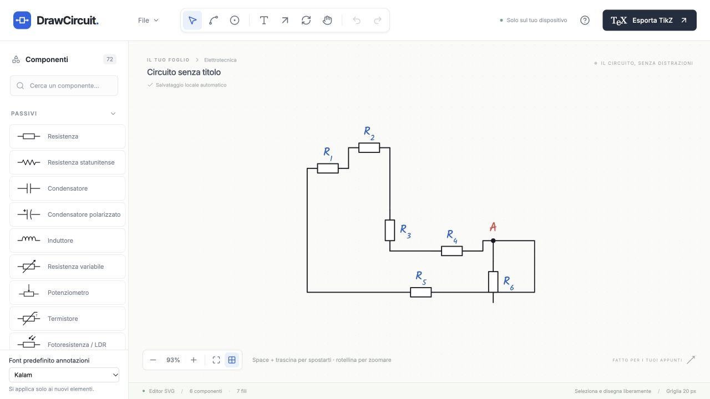

# Smart Placement — implementazione e verifica

Verifica del 2 ottobre 2026. Il pass è additivo: la funzione originale di inserimento libero rimane il fallback. Modello, store, snapping precedente, Wire, Quick Junction, selezione, drag, annotazioni, serializzazione ed exporter non sono stati riscritti.

## 1. Funzionalità implementate

- Ghost con lo stesso simbolo, opacità e griglia precedenti, arricchito dai terminali; nessun oggetto viene inserito durante la preview.
- Punti collegabili dei componenti e delle Junction visibili durante il placement. Lo strumento Wire conserva i suoi handle e il suo comportamento originali.
- Terminali liberi vuoti, occupati pieni. Le connessioni multiple rimangono consentite.
- Snap magnetico del terminale della preview su terminali, Junction e segmenti di filo, con feedback verde e conferma esplicita.
- Click-to-anchor, preview tratteggiata del collegamento, orientamento assistito dei bipoli e priorità della rotazione manuale.
- Guide finite di allineamento, al massimo una per asse. Sono informative: non spostano il normale placement libero.
- Snap su filo con creazione di Junction e divisione dei fili incidenti.
- Inserimento inline orizzontale e verticale, attivato esplicitamente con **Inserisci in filo**.
- Scelta esplicita del pin per componenti con più terminali, connettore a due pin e porte logiche.
- Evidenza del terminale libero dopo un collegamento e continuazione senza tornare alla palette.
- Preview e snap anche trascinando un nuovo componente dalla palette.
- Alt/Option sospende temporaneamente le nuove assistenze; R ed Esc conservano le proprie funzioni.

## 2. Magnetic snapping

L’acquisizione usa **16 pixel dello schermo**, convertiti in coordinate del canvas. Il target acquisito può essere mantenuto fino a **20 pixel**; un concorrente della stessa priorità deve migliorare la distanza di oltre **4 pixel** per sostituirlo. Ordine: Junction, terminale, filo, griglia.

Il rilevamento usa le coordinate reali del cursore e dei terminali ruotati; la preview viene traslata fino alla coincidenza esatta. La conferma di uno snap o di un inserimento inline richiede che il relativo candidato fosse già mostrato. Il semplice overlap di un placement libero non aggiunge fili.

A zoom basso, il terminale della preview più vicino prevale sul centro del ghost quando entrambi cadono nella hitbox di un target. Un clic diretto sul target continua ad avviare l’ancoraggio. Test del detector e dell’interazione a zoom **15%, 50%, 100%, 200%, 400%**; prova browser anche al 15%.

Un indice spaziale in cache per documento limita la ricerca a celle vicine. Gli handle sono limitati alla viewport e il loro rendering viene riusato. A Select, drag e pan non viene costruito l’indice del placement. Non sono state misurate garanzie di FPS o heap.

## 3. Click-to-anchor

Con un componente scelto, il clic su un terminale o Junction evidenziati memorizza l’endpoint, senza modificare documento o cronologia. Muovere il mouse mostra il nuovo componente e il filo che sarà creato; il secondo clic conferma entrambi in un commit.

I bipoli compatibili si orientano lungo la direzione prevalente del mouse. Il pin rivolto verso l’ancora viene scelto geometricamente. **R ruota di 90° l’orientamento effettivamente mostrato** e blocca l’orientamento manuale per quel placement. Nel placement libero R continua a usare la rotazione originale.

Esc, cambio strumento, riselezione dalla palette, pointer cancellation ed eliminazione della sorgente eliminano lo stato provvisorio. Un’ancora valida segue eventuali cambiamenti della posizione del suo endpoint.

## 4. Wire snapping

Un terminale vicino a un segmento mostra il punto candidato. Confermare crea una Junction mediante `insertJunction`, riutilizzando la divisione dei fili già esistente, e un Wire dal nodo al terminale scelto. Il documento completo viene applicato con un solo commit. Spostare il componente o il nodo mantiene i riferimenti.

## 5. Inline insertion e intenzionalità

**Inserisci in filo** attiva una sessione esplicita. Il candidato mostra il tratto interrotto, entrambi i terminali e il testo “Inserisci nel filo · clic per confermare”. Il clic crea il componente e due porzioni del filo riferite ai suoi terminali; preserva gli endpoint originali, le svolte e lo stile.

Compatibile con resistenze europee/statunitensi, condensatori, induttori, diodi, interruttori semplici, fusibili e gli altri bipoli con terminali collineari supportati dalla libreria. Orientamento orizzontale/verticale assistito, salvo una rotazione manuale.

I segmenti troppo corti, i tagli che comprenderebbero nodi, terminali, rami o incroci, e un orientamento manuale incompatibile non producono preview inline. In quei casi il clic usa il placement libero originale e conserva la topologia.

## 6. Componenti multi-terminal

Transistor, MOSFET, JFET, op amp, trasformatori, potenziometri, connettori e porte logiche mostrano tutti i pin. **Aggiornamento 4 ottobre 2026:** la barra di scelta è stata rimossa e il terminale viene scelto automaticamente dal target e dalla distanza dei pin del ghost. Restano soltanto gli indicatori grafici della preview; ID e nomi semantici originali sono preservati, senza una nuova rotazione automatica per questi componenti.

Nel browser: NPN mostrato inizialmente senza snap; dopo aver scelto `base`, acquisizione del terminale di R2 e inserimento collegato. Collector ed emitter rimangono distinti.

## 7. Modello dati e cronologia

**Nessuna modifica al modello dati o alla versione JSON.** Tutti i collegamenti usano Wire con gli endpoint esistenti:

```ts
{
  kind: ('terminal', componentId, terminalId);
}
{
  kind: ('junction', junctionId);
}
```

Un aggancio diretto può avere un Wire di lunghezza iniziale zero: il riferimento esiste semanticamente e il percorso diventa visibile quando uno dei componenti si sposta. Gli stati di preview, guida, ancora e inline non vengono serializzati. Nessuna nuova chiave localStorage.

Inserimento smart, snap su filo e inline richiedono **un solo Undo**; Redo ripristina il risultato completo. Lo store originale gestisce la cronologia.

## 8. File nuovi

| File                                          | Responsabilità                                 |
| --------------------------------------------- | ---------------------------------------------- |
| `src/smartPlacement/types.ts`                 | Sessioni e preview discriminate                |
| `src/smartPlacement/spatialIndex.ts`          | Indice di terminali, nodi, centri e segmenti   |
| `src/smartPlacement/findCandidates.ts`        | Snap, isteresi, ancore, inline e guide         |
| `src/smartPlacement/smartConnection.ts`       | Costruzione immutabile del risultato semantico |
| `src/smartPlacement/useSmartPlacement.ts`     | Sessione di placement e conferma               |
| `src/smartPlacement/PlacementLayer.tsx`       | Ghost, terminali, guide e feedback             |
| `tests/smart-placement.test.ts`               | Detector e topologia                           |
| `tests/smart-placement-interactions.test.tsx` | Workflow attraverso palette e canvas           |
| `docs/smart-placement/report.md`, `evidence/` | Report, circuito riapribile e prove            |

## 9. File esistenti modificati

- `src/components/editor/useCanvasInteractions.ts`: innesti per smart move/click/drop, riuso dei listener tastiera, dimensioni della superficie.
- `src/components/editor/Canvas.tsx`: layer di preview e controlli opzionali di inline/pin.
- `src/components/palette/Palette.tsx`: eventi di inizio/fine trascinamento dei nuovi componenti.
- `src/styles.css`: stili del nuovo layer di assistenza e cursori.
- `README.md`: istruzioni del nuovo workflow.

Confronto con la copia iniziale: **types, catalog, serialization, editorStore, geometry, wires, operations, SelectionLayer, loops e TikZ exporter sono invariati**. Anche gli 11 file della suite precedente sono invariati.

## 10. Test automatici e comandi

**Prima:** 281 test passati, lint e build riusciti.

**Dopo:** 334 test passati in 13 file, di cui **53 nuovi**: 31 per detector/topologia e 22 per interazioni. Lint e build riusciti. Le nuove prove coprono nearest terminal, cinque zoom, priorità/isteresi, terminal-to-terminal, Junction, wire, creazione automatica del nodo, inline orizzontale/verticale, curve del filo conservate, Undo/Redo, spostamento dopo la connessione, JSON/TikZ, pin espliciti per nove famiglie, Alt/Option, fallback libero, drag dalla palette e cancellazione di stati provvisori.

Log: [lint](evidence/lint.log), [build](evidence/build.log), [test](evidence/tests.log).

## 11. Regressioni verificate

| Workflow precedente                                 | Prima            | Dopo                                                                |
| --------------------------------------------------- | ---------------- | ------------------------------------------------------------------- |
| Placement libero in zona vuota, ripetizione e R/Esc | Suite precedente | Suite precedente + nuove prove + browser                            |
| Wire manuale e waypoint                             | Suite precedente | Suite precedente + filo costruito nel browser                       |
| Junction e Quick Junction manuali                   | Suite precedente | Suite precedente; helper invariato                                  |
| Drag di componenti esistenti                        | Suite precedente | Suite precedente + R2/R6 nel browser                                |
| Rotazione del componente                            | Suite precedente | Suite precedente; rotazione della selezione invariata               |
| Undo/Redo                                           | Suite precedente | Suite precedente + inline orizzontale/verticale nel browser         |
| Salvataggio e riapertura JSON                       | Suite precedente | Suite precedente + file scaricato/riaperto nel browser              |
| TikZ dei circuiti precedenti                        | Suite precedente | Suite precedente + confronto byte per byte dell’esempio nel browser |

Le prove precedenti coprono inoltre selezione/multiselect, pan/zoom, copia/incolla, duplicazione, eliminazione, label/font, toolbar, Arrow e Loop Arrow. Non vengono dichiarate prove browser aggiuntive di clipboard per questo pass.

## 12. Parti limitate per evitare conflitti

- Nessuna inline insertion implicita dalla semplice vicinanza al corpo di un filo: si usa il comando visibile dedicato.
- Nessuno smart snap durante il trascinamento dei componenti già inseriti: il drag originale rimane invariato.
- Nessuna scelta automatica di pin per elementi con semantica multipla.
- Nessuna modifica degli snapping, shortcut o gesture esistenti di Wire/Junction/resize.
- Nessun taglio inline attraverso branch o incroci ambigui; il fallback conserva il filo originale.
- Nessun autorouting aggiuntivo, simulazione, SPICE o auto layout.

## 13. Golden UX Test nel browser reale

Eseguito tramite Browser integrato sulla versione locale, con verifica finale sulla **build di produzione**.

| Passi                                    | Esito osservato                                                                                                                                     |
| ---------------------------------------- | --------------------------------------------------------------------------------------------------------------------------------------------------- |
| 1–3: canvas vuoto → Resistor → R1 libero | R1 a `(-160,-80)`, rotazione 0°, griglia originale                                                                                                  |
| 4–8: R2, handle di R1, snap e clic       | Preview a `(-80,-80)`; terminali coincidenti, Wire semantico                                                                                        |
| 9: R3 verticale con smart connection     | Ancora sul terminale destro di R2; preview tratteggiata; R3 a `(-40,40)`, 90°                                                                       |
| 10: aggiunta R4                          | Ancora sul terminale libero di R3; R4 a `(80,80)`                                                                                                   |
| 11: resistor nel filo                    | Wire manuale con tre svolte; inline R5 a `(20,160)`; tratto tagliato e riferimenti ai due pin                                                       |
| 12–13: movimento di un componente        | R2 spostato da `(-80,-80)` a `(-80,-120)`; collegamenti di entrambi i lati seguono                                                                  |
| 14–15: movimento Junction                | R6 con snap su filo crea un nodo; nodo spostato a `(160,60)`; tutti i fili incidenti seguono                                                        |
| 16–17: Undo/Redo dell’inline             | Verificati subito dopo l’inserimento: un Undo ripristina il filo completo, un Redo ripristina R5 e le due porzioni. Ripetuto su inline verticale R7 |
| 18–19: JSON e riapertura                 | File realmente scaricato, nuova superficie vuota, riapertura dello stesso JSON. Livelli di fili, componenti, nodi, label e annotazioni identici     |
| 20: TikZ                                 | Export generato e finito; conservato nelle evidenze. Esempio precedente identico byte per byte alla baseline                                        |

Undo/Redo inline è stato provato prima dei successivi drag: dopo un drag, il primo Undo deve continuare ad annullare il drag, come prima. Non è stata introdotta una cronologia che salta operazioni.

Prove extra nella build di produzione: R su ghost verticale assistito produce 180° e mantiene la scelta dopo un movimento orizzontale; un clic con Alt inserisce senza aumentare il numero di fili; snap al 15%; reload da localStorage conserva tutti i livelli del circuito; **zero errori e zero warning** nella console finale.

Il browser integrato ha mandato in timeout l’attesa dell’evento download, ma il JSON è stato effettivamente trovato in Downloads e riaperto attraverso il file chooser. Durante l’aggiunta degli hook a server di sviluppo acceso, HMR ha richiesto reload; questi messaggi non si riproducono nella build finale di produzione.

### Evidenze

- [Circuito JSON riapribile](evidence/golden-browser.json)
- [TikZ esportato](evidence/golden-browser.tex)
- [Console della build finale](evidence/console-production.json)
- [Snap magnetico](evidence/01-magnetic.png)
- [Preview inline](evidence/02-inline-preview.png)
- [NPN con pin esplicito](evidence/03-npn-explicit-pin.png)
- [Circuito finale](evidence/04-golden-final.png)


